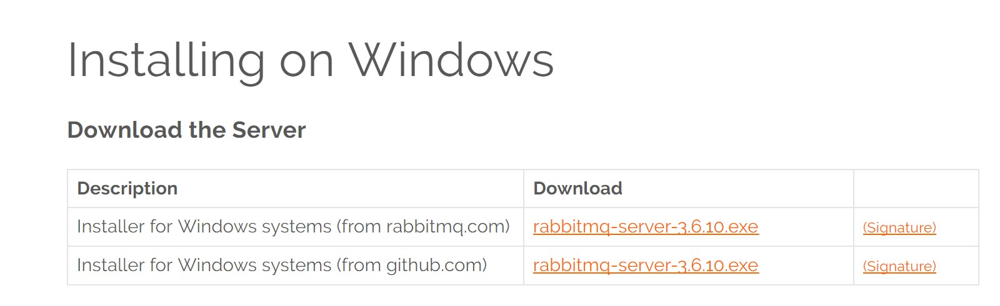
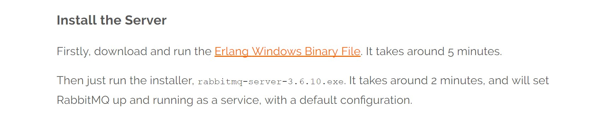

# WeSHA
Home automation project based on WebSharper, AMQP technologies and ESP8266 module

Project in early development stage
# How to get started?
### Install Visual Studio
* Install Visual Studio 2015 to build and run the project

### Install WebSharper
* Download and install WebSharper. Use the link http://websharper.com/downloads
* To begin download, click on “WebSharper 4 beta”  
  
* After Installation, WebSharper will automatically add as extension to your Visual studio

### Install RabbitMQ
* Go to RabbitMQ installation webpage at https://www.rabbitmq.com/install-windows.html and download installer file  
  
* Firstly, Install Erlang Windows Binary File and then run rabbitmq-server-3.6.10.exe downloaded file  
  
* Enable the RabbitMQ management plugin:
  * Go to the installation folder location of RabbitMQ Server
  * Then, follow the path RabbitMQ Server\rabbitmq_server-3.6.10\sbin
  * Start Cmd.exe at RabbitMQ Server\rabbitmq_server-3.6.10\sbin location
  * Type command: rabbitmq-plugins enable rabbitmq_management
  * Launch Web UI at http://server-name:15672/ (Replace the “server-name” with “localhost”)
  * Default Username is “guest” and password is “guest”
  * Add new user should be “guest1” with password “guest1”
  * Click on Admin tab. Type “Admin” in “Tag” field to set Administrator rights
  * Click on “Queues” tab and then drop down “Publish message” to publish messages
